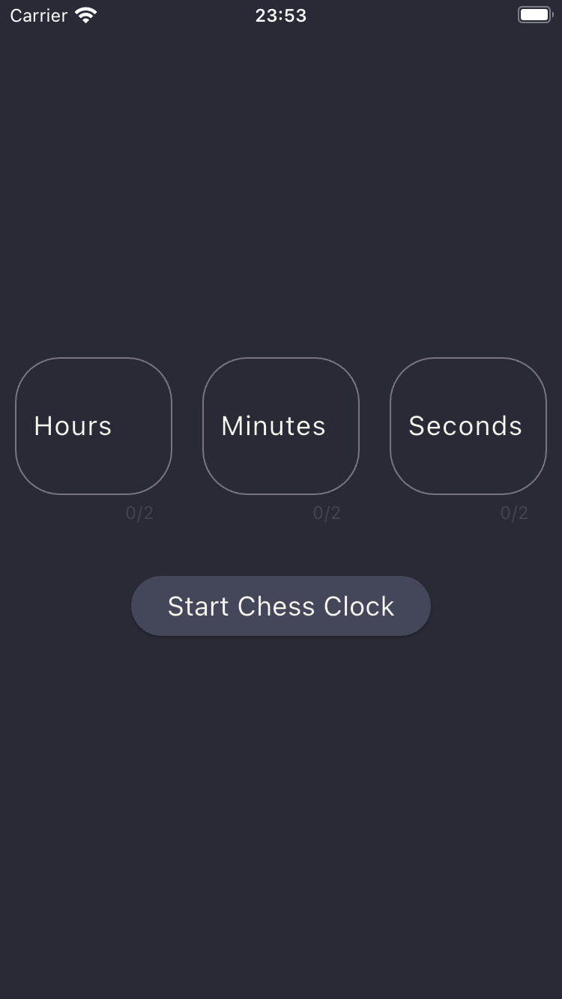
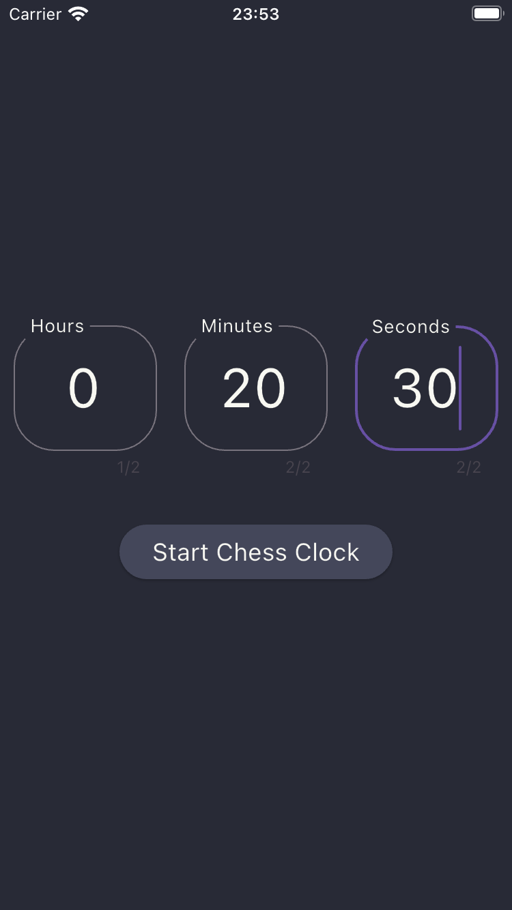
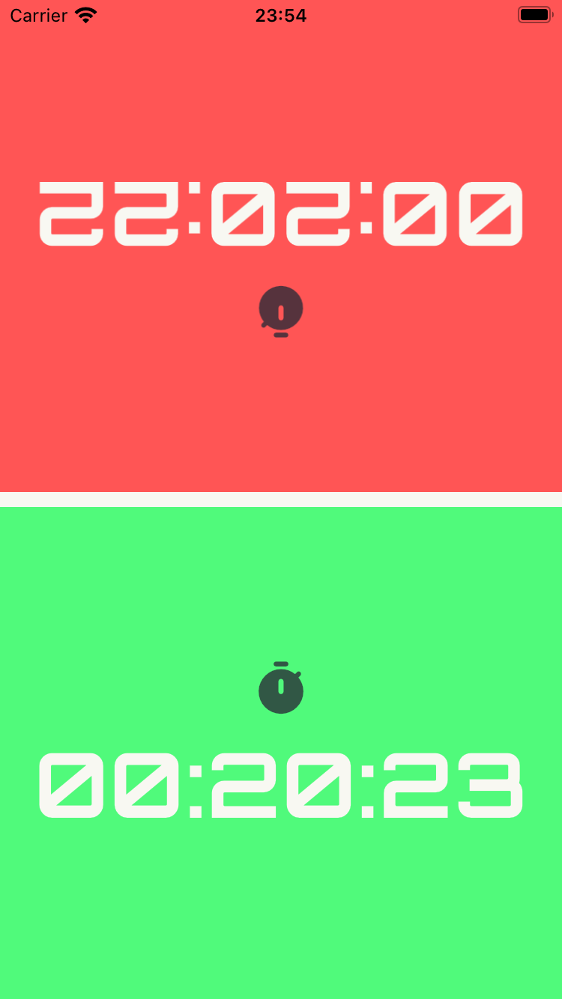

# Dice Roller App

Project designed to simulate the turn clock for a chess match. If it is the first player's turn, only the first clock decreases its time. If it is the second player's turn, vice versa.

---

